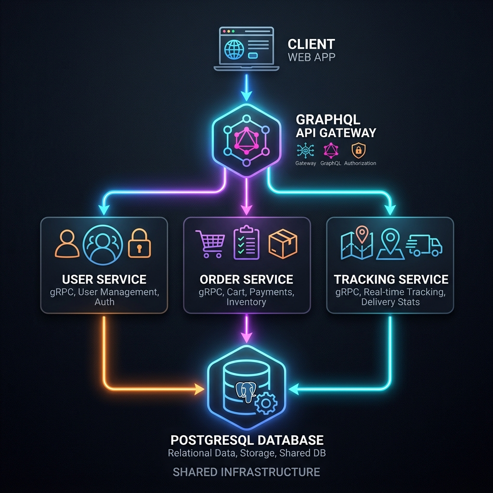
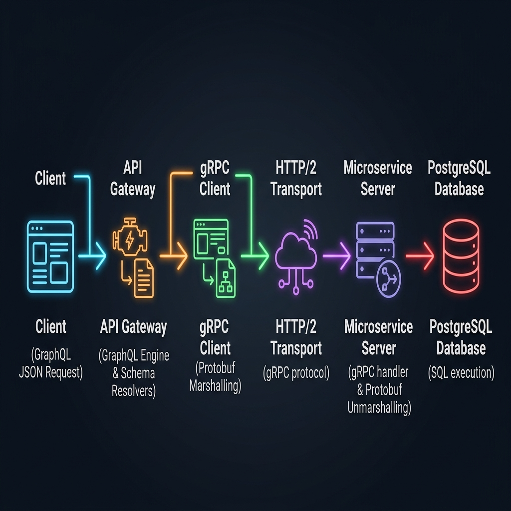

# Microservices Architecture with GraphQL API Gateway


A comprehensive and scalable microservices-based application built with **Go**. It features a **GraphQL API Gateway** serving as the single entry point, communicating with multiple backend services via **gRPC**. Data is persisted using **PostgreSQL**.

---

## 🏛 Architecture Overview

The system is composed of several independent services communicating over high-performance gRPC, all exposed to the client via a unified GraphQL API Gateway.



### Services

| Service | Protocol | Description | Port (Internal) |
| :--- | :--- | :--- | :--- |
| **API Gateway** | GraphQL (HTTP) | The primary entry point for all client requests. Resolves GraphQL queries by orchestrating calls to backend gRPC services. | `8080` |
| **User Service** | gRPC | Manages user profiles, authentication, and user-related operations. | `50051` |
| **Order Service** | gRPC | Handles order creation, management, and integrates with User Service for validations. | `50052` |
| **Tracking Service** | gRPC | Manages shipment tracking and coordinates with Order Service for status updates. | `50053` |
| **PostgreSQL DB** | TCP | Shared or partitioned relational database for persistent storage. | `5432` / `5433` (Host) |

---

## 🛠 Tech Stack

- **Language:** [Go (Golang)](https://go.dev/)
- **API Gateway:** [GraphQL](https://graphql.org/) (via [gqlgen](https://gqlgen.com/))
- **Inter-service Communication:** [gRPC](https://grpc.io/) / Protocol Buffers
- **Database:** [PostgreSQL](https://www.postgresql.org/)
- **Containerization & Orchestration:** [Docker](https://www.docker.com/) & Docker Compose

---

## 🚀 Getting Started

### Prerequisites

Ensure you have the following installed:
- [Docker](https://docs.docker.com/get-docker/)
- [Docker Compose](https://docs.docker.com/compose/install/)
- [Postman](https://www.postman.com/) (Optional, for API testing)
- [Go 1.20+](https://go.dev/doc/install) (Optional, for local development outside Docker)

### Running the Application

1. **Clone the repository:**
   ```bash
   git clone <your-repository-url>
   cd Microservices
   ```

2. **Start the services using Docker Compose:**
   ```bash
   docker-compose up -d --build
   ```
   *This command builds the Go binaries for the API Gateway and all microservices, sets up the PostgreSQL database, and links them via a dedicated Docker network.*

3. **Verify running containers:**
   ```bash
   docker-compose ps
   ```

4. **Access the API Gateway:**
   - The GraphQL API will be available at: `http://localhost:8080/query`
   - You can also navigate to `http://localhost:8080/` (if configured) for the GraphQL Playground.

---

## 🌍 Production Deployment

The project has been prepared for production deployment on platforms like Render, Railway, Fly.io, or Kubernetes. 

### Configuration

All services are configurable via environment variables. An example configuration is provided in `.env.example`.
- **Ports**: API Gateway and gRPC services dynamically bind to `PORT` or fallback to defaults.
- **Service Addresses**: `USER_SERVICE_ADDR`, `ORDER_SERVICE_ADDR`, and `TRACKING_SERVICE_ADDR` configure gRPC client dialing.
- **Database**: Connect via `DATABASE_URL` with connection pooling configured for PostgreSQL.

### Health Checks and Resilience

- **HTTP**: The API Gateway exposes a `/healthz` endpoint for load balancers.
- **gRPC**: Backend services implement `grpc_health_v1` for standard gRPC health probes.
- **Graceful Shutdown**: All services listen for `SIGTERM`/`SIGINT` and shut down gracefully, draining connections safely.
- **Resiliency**: gRPC clients are configured with a retry policy (MaxAttempts: 4) using `WithDefaultServiceConfig`.

---

## 🧪 Testing with Postman

A comprehensive Postman collection is included to test the API endpoints.

1. Open **Postman**.
2. Click **Import** and select the `Microservices_API_Gateway.postman_collection.json` file located in the root of the project.
3. Execute the pre-configured GraphQL queries and mutations to interact with the system.

---

## 📖 Detailed Request Flow

For an in-depth look at how requests propagate through the system, refer to the detailed flow diagram:



---

## 🛑 Stopping the Services

To stop and remove the containers, networks, and volumes (optional), run:

```bash
docker-compose down
```
*(To also remove the database volume, append the `-v` flag)*